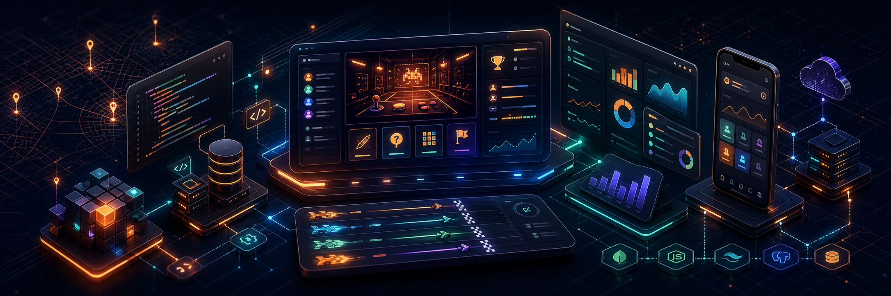

  

<h1 align="center">Gagan Kumar</h1>

  Full-stack developer building real-time products, SaaS dashboards, API systems, and polished user interfaces.

  <a href="https://gagankumar.me">Portfolio</a>
  |
  <a href="https://github.com/Gagan1015">GitHub</a>
  |
  <a href="https://linkedin.com/in/gagan-kumar1510">LinkedIn</a>
  |
  <a href="mailto:gagansaini1510@gmail.com">Email</a>

  
  
  

## Profile

I build full-stack applications from the database layer to the final interface. My recent work is centered on TypeScript monorepos, real-time multiplayer systems, admin tooling, REST APIs, authentication, analytics, and deployment-ready product foundations.

I like projects where the backend architecture, realtime state, and interface quality all matter. The common thread across my work is simple: ship useful software that feels fast, organized, and credible.

## Current Focus

- Real-time multiplayer systems with Socket.IO, shared contracts, and authoritative server runtimes.
- Product-grade dashboards with admin workflows, moderation, analytics, and reliable data models.
- TypeScript frontends that balance clean UI, responsive behavior, and maintainable component structure.
- Laravel, PHP, Node.js, and database-backed applications for business operations and SaaS tools.

## Selected Work

| Project | What it is | Stack | Links |
| --- | --- | --- | --- |
| Arcado | Real-time multiplayer arcade with private rooms for drawing, trivia, word, and flag games. | Next.js, TypeScript, Socket.IO, Prisma, PostgreSQL, Docker, AWS | [Repo](https://github.com/Gagan1015/Arcado), [Live](https://arcado.gagankumar.me) |
| TypeRacer | Competitive typing platform with solo races, multiplayer rooms, leaderboards, ranked play, and admin moderation. | React, Vite, TypeScript, Express, Socket.IO, MongoDB, Zustand | [Repo](https://github.com/Gagan1015/TypeRacer), [Live](https://typeracer.gagankumar.me/login) |
| Portfolio | API-driven personal portfolio with a React frontend and Laravel backend. | React, TypeScript, Laravel, REST APIs, MySQL, PostgreSQL | [Repo](https://github.com/Gagan1015/Gagan_Kumar_Portfolio), [Live](https://gagankumar.me) |
| Expensly | Expense management platform for budgets, spending insights, and finance tracking. | Laravel, Blade, PHP, JavaScript, CSS, Docker | [Repo](https://github.com/Gagan1015/Expensly), [Live](https://expansly.app) |
| Gaon Wali Chai | Android app concept for discovering authentic village-style chai vendors. | Flutter, Dart, PHP, Laravel | [Repo](https://github.com/Gagan1015/Gaon-Wali-Chai) |
| InvoiceLab | Invoice and business management system with customers, inventory, PDF generation, and secure sessions. | PHP, MySQL, JavaScript, CSS, Bootstrap | [Repo](https://github.com/Gagan1015/InvoiceLab) |

## Stack

  
  
  
  
  
  
  
  
  
  
  
  
  
  
  
  

## Engineering Strengths

| Area | How I work |
| --- | --- |
| Product engineering | I connect user flows, data models, backend behavior, and UI states instead of treating them as separate problems. |
| Realtime systems | I build room-based flows, socket events, lifecycle states, score updates, and multiplayer feedback loops. |
| Backend foundations | I design REST APIs, authentication, validation, persistence, admin tooling, and deployment-ready service structure. |
| Interface craft | I care about responsive layouts, clean visual hierarchy, practical dashboards, and small details that make products feel finished. |

## GitHub Metrics

  
  

## Connect

  
  
  

Open to full-stack, backend, and product engineering opportunities.
